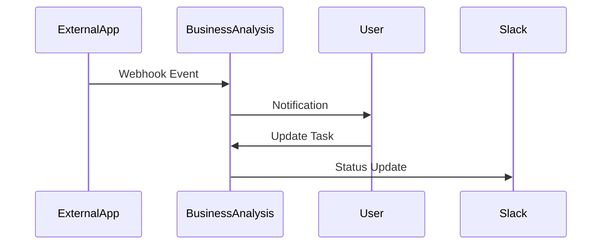

## Overview

Connect BusinessAnalysis.io to your favorite third-party tools to streamline task management, project tracking, and collaboration. You gain access to real-time updates, automated data import/export, and custom workflows that enhance productivity without leaving your dashboard. Supported integrations include communication apps, automation platforms, calendars, and version control systems.

<Callout kind="tip">
Enable integrations from your account settings to unlock features like automatic task syncing and notification forwarding.
</Callout>

## Popular Integrations

Discover ready-to-use connections that fit your workflow.

<Columns cols={3}>
  <Card title="Slack" icon="message-circle" href="/docs/slack-integration">
    Send task updates and project notifications directly to Slack channels.
  </Card>
  <Card title="Zapier" icon="zap" href="/docs/zapier-integration">
    Automate workflows with 5000+ apps using no-code zaps.
  </Card>
  <Card title="Google Workspace" icon="calendar" href="/docs/google-workspace">
    Sync tasks with Google Calendar and Sheets for seamless scheduling.
  </Card>
</Columns>

<Columns cols={2}>
  <Card title="GitHub" icon="github" href="/docs/github-integration" horizontal>
    Link issues and pull requests to projects for developer teams.
  </Card>
  <Card title="Trello" icon="trello" href="/docs/trello-migration" horizontal cta="Migrate Now">
    Import boards and cards effortlessly.
  </Card>
</Columns>

## Set Up an Integration

Follow these steps to connect any supported tool.

<Steps>
  <Step title="Navigate to Settings" icon="settings">
    Open your BusinessAnalysis.io dashboard and select `Integrations` from the sidebar menu.
  </Step>
  <Step title="Choose Provider" icon="plug">
    Search for your tool, such as Slack or Zapier, and click `Connect`.
  </Step>
  <Step title="Authorize Access" icon="key">
    Grant permissions via OAuth. You see a consent screen from the provider.
  </Step>
  <Step title="Configure Triggers" icon="zap">
    Select events like `task completed` or `project milestone reached` to trigger actions.
  </Step>
  <Step title="Test Connection" icon="play">
    Run a test sync and verify data flows correctly.
  </Step>
</Steps>

## Data Import and Export

Import tasks from spreadsheets or export reports for analysis.

<Tabs>
  <Tab title="Import CSV" icon="upload">
    Upload a CSV file matching this format:

    ````csv
    Title,Description,Due Date,Assignee
    Review Q3 Report,Analyze sales data,2024-10-15,john@company.com
    Client Meeting Prep,Prepare slides,2024-10-10,sarah@company.com
    ````

    Map columns during upload to match BusinessAnalysis.io fields.
  </Tab>
  <Tab title="Export JSON" icon="download">
    Generate exports via API:

    <CodeGroup tabs="JavaScript,cURL">
      ````javascript
      const response = await fetch('https://api.businessanalysis.io/v1/export/tasks?projectId=proj_123', {
        headers: {
          'Authorization': `Bearer ${YOUR_API_KEY}`,
          'Content-Type': 'application/json'
        }
      });
      const data = await response.json();
      console.log(data.tasks);
      ````

      ````bash
      curl -H "Authorization: Bearer YOUR_API_KEY" \
           -H "Content-Type: application/json" \
           https://api.businessanalysis.io/v1/export/tasks?projectId=proj_123
      ````
    </CodeGroup>
  </Tab>
</Tabs>

## Custom Workflow Setup

Build advanced automations with webhooks for real-time communication.

<Expandable title="Webhook Configuration" default-open="false">
Set up incoming webhooks to trigger actions on external events.

```javascript
// Example payload received by BusinessAnalysis.io
{
  "event": "issue.created",
  "data": {
    "title": "Fix login bug",
    "repo": "businessanalysis/webapp"
  }
}
```

Configure the webhook URL: `https://api.businessanalysis.io/v1/webhooks/inbound/YOUR_WEBHOOK_ID`
</Expandable>

Visualize a sample workflow:



<Callout kind="success">
Test all integrations in a sandbox project before production use.
</Callout>