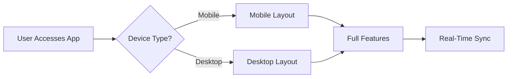

## Overview

BusinessAnalysis.io empowers you to streamline your workflow with powerful task management, project tracking, time logging, and team collaboration features. You create tasks, assign them to team members, set due dates, and monitor progress in real-time. Build projects with milestones, generate detailed time reports, and share files seamlessly. The platform uses AI agents during development to produce layout mockups, workflows, and data models, ensuring a modern, responsive design.

## Key Features

Discover the core capabilities that make BusinessAnalysis.io your go-to tool.

<Columns cols={2}>
  <Card title="Task Management" icon="check-square" href="/docs/tasks">
    Create, assign, and track tasks with due dates and progress indicators. Prioritize your workload effortlessly.
  </Card>
  <Card title="Project Management" icon="folder" href="/docs/projects">
    Organize projects with milestones and status updates. Visualize progress at a glance.
  </Card>
  <Card title="Time Tracking" icon="clock" href="/docs/time-tracking">
    Log hours, generate reports, and integrate with calendars. Analyze productivity trends.
  </Card>
  <Card title="Collaboration" icon="users" href="/docs/collaboration">
    Share files, chat in real-time, and stay updated with notifications.
  </Card>
</Columns>

## Key Benefits

You gain efficiency and insights from BusinessAnalysis.io's design.

| Benefit              | Description                                                                 |
|----------------------|-----------------------------------------------------------------------------|
| Intuitive Interface  | Navigate easily with a clean, visually appealing dashboard.                 |
| Real-Time Updates    | Receive instant notifications for task changes and project milestones.      |
| Custom Reports       | Export time tracking data in CSV or PDF for analysis.                       |
| Responsive Design    | Access full functionality on desktop, tablet, or mobile devices.            |

<Callout kind="tip">
  Customize your dashboard colors to match your brand, such as `#d44d42` for accents.
</Callout>

## Target Audience

BusinessAnalysis.io serves diverse users. Choose your scenario below.

<Tabs>
  <Tab title="Individuals" icon="user">
    Freelancers and solopreneurs use it to manage personal tasks, track billable hours, and meet deadlines without complexity.
  </Tab>
  <Tab title="Teams" icon="users">
    Small teams and agencies collaborate on projects, assign roles, and generate shared reports for clients.
  </Tab>
  <Tab title="Enterprises" icon="building">
    Larger organizations scale with advanced permissions, integrations, and audit logs for compliance.
  </Tab>
</Tabs>

## Visual Design and Responsiveness

The platform features a modern UI built with responsive principles. AI-generated mockups ensure layouts adapt to any screen size. You experience fluid navigation on mobile devices, with touch-friendly controls and optimized performance.



<Expandable title="Advanced Customization" default-open="false">
  Inject custom CSS for themes:

  <CodeGroup tabs="CSS,SCSS">
  ```css
  .dashboard {
    --primary-color: #d44d42;
    accent-color: var(--primary-color);
  }
  ```
  ```scss
  .dashboard {
    --primary-color: #d44d42;
    accent-color: var(--primary-color);
  }
  ```
  </CodeGroup>
</Expandable>

## Get Started in Minutes

Follow these steps to launch your first project.

<Steps>
  <Step title="Sign Up" icon="user-plus">
    Create your free account at `https://businessanalysis.io/register`.
  </Step>
  <Step title="Create Project" icon="plus">
    Click **New Project** and set milestones.
  </Step>
  <Step title="Add Tasks" icon="check-square">
    Assign tasks with due dates and labels.
  </Step>
  <Step title="Track Time" icon="clock">
    Start timer on tasks and review reports.
  </Step>
</Steps>

<Callout kind="success">
  Integrate via API for custom workflows. Use `YOUR_API_KEY` in requests to `https://api.businessanalysis.io/v1/tasks`.
</Callout>